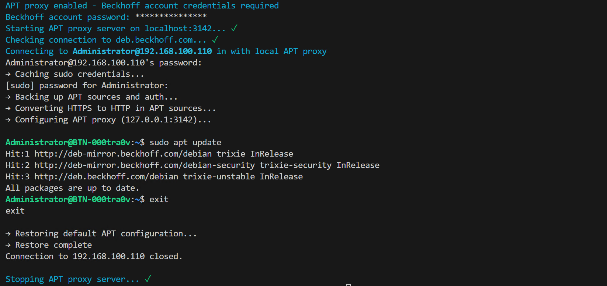
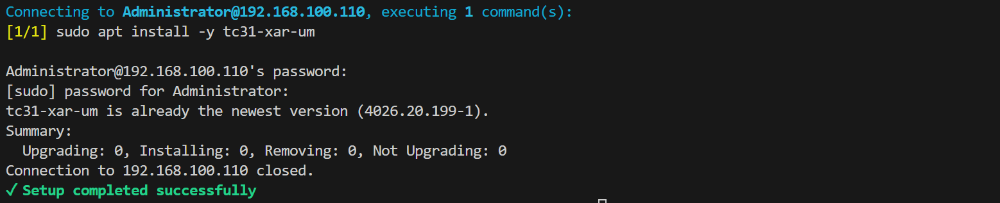
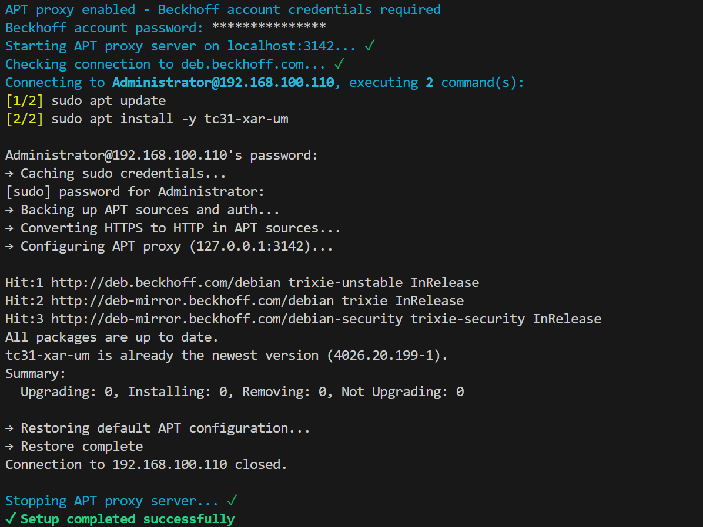

# bck-linux-setup

CLI tool for managing Beckhoff RT Linux® devices via SSH with APT proxy support. Install packages on offline targets and automate device provisioning through your local machine.

## ⚠️ Disclaimer

This is experimental project, not affiliated with Beckhoff Automation. Use at your own risk. Authors are not responsible for any damage or data loss. Always test in a safe environment first.

This tool makes changes to package management configuration on target device and which could cause potentital security issues.

## Features

- **Offline Target Support**: Install packages on offline devices via local proxy
- **Interactive Mode**: SSH shell with optional APT proxy
- **Command Execution Mode**: Automated target setup via config file
- **Auto-Authentication**: Inject credentials for authenticated Beckhoff repositories

## Installation

### Install Bun

Bun is a fast JavaScript runtime required to run this tool.

```bash
# Linux/macOS
curl -fsSL https://bun.sh/install | bash

# Windows
powershell -c "irm bun.sh/install.ps1|iex"
```

### Install from GitHub

```bash
bun install -g https://github.com/sgorsh/bck-linux-setup#v0.1.2
```

### Upgrade to Latest Version
```bash
bun remove -g bck-linux-setup
bun install -g https://github.com/sgorsh/bck-linux-setup#v0.1.2
```

### Install from Source

```bash
git clone https://github.com/sgorsh/bck-linux-setup.git
cd bck-linux-setup
bun install -g .
```

### Uninstall

```bash
bun remove -g bck-linux-setup
```

## Requirements

- [Bun](https://bun.sh) runtime (>= 1.3.0)
- SSH client installed
- SSH access to target Beckhoff device
- myBeckhoff account credentials (only for offline package install)

## Usage

The tool supports 4 distinct operating modes based on two factors: **interactive vs. automated** and **with/without proxy**.

### Mode 1: Interactive without Proxy

Standard SSH connection for device management when the target has internet access.

**Usage:**
```bash
bck-linux-setup <host>
```

**Example:**
```bash
bck-linux-setup 192.168.100.110
```

**Output:**


**Use when:** Target device has internet access to Beckhoff repositories.

### Mode 2: Interactive with Proxy

SSH connection with local APT proxy enabled. Allows package installation on offline devices through your local machine. Commands are run manually. Only `apt` commands are affected.

**Usage:**
```bash
bck-linux-setup <host> --use-proxy [--bck-username=email@example.org]
```

**Example:**
```bash
# Enable proxy for offline device
bck-linux-setup 192.168.100.110 --use-proxy

# Enable with myBeckhoff account username
bck-linux-setup 192.168.100.110 --use-proxy --bck-username=email@example.org
```

**Output:**


**Use when:** Target device is offline or behind a firewall, requiring authenticated access to Beckhoff repositories through a proxy on local machine.

### Mode 3: Running Commands without Proxy

Execute predefined commands from config file and exit. For automated provisioning when target has internet access.

**Usage:**
```bash
bck-linux-setup 192.168.100.110 --run-commands --config <path>
```

**Example config.json:**
```json
{
  "username": "Administrator",
  "useProxy": false,
  "commands": [
		"sudo apt install -y tc31-xar-um"
  ]
}
```

**Example:**
```bash
bck-linux-setup 192.168.100.110 --run-commands --config config.json
```

**Output:**

**Use when:** Automating device setup with scripted commands on targets with internet access.

### Mode 4: Running Commands with Proxy

Execute predefined commands with local APT proxy enabled. For automated provisioning of offline devices.

**Usage:**
```bash
bck-linux-setup 192.168.100.110 --run-commands --config config.json
```

**Example config.json:**
```json
{
  "username": "Administrator",
  "useProxy": true,
  "commands": [
		"sudo apt update",
		"sudo apt install -y tc31-xar-um"
  ]
}
```

**Example:**
```bash
bck-linux-setup 192.168.100.110 --run-commands --config config.json --bck-username=email@example.org
```

**Output:**


**Use when:** Automating setup on offline devices requiring authenticated access to Beckhoff repositories.

## Configuration

Config file is **optional** for interactive mode, **required** for command execution mode.

Create a `config.json` file based on the provided example:

```bash
cp config.example.json config.json
```

### Configuration Format

```json
{
  "username": "Administrator",
  "useProxy": true,
  "commands": [
    "sudo apt update",
    "sudo apt install -y tc31-xar-um"
  ]
}
```

### Configuration Options

| CLI Arg | Config parameter | Type | Default | Description |
|---------|-----------|------|---------|-------------|
| `<host>` | - | string | - | Target IP or hostname |
| `--username` | `username` | string | `Administrator` | SSH user |
| - | `commands` | string[] | `[]` | Commands to execute (config file only, required for `--run-commands`) |
| `--use-proxy` | `useProxy` | boolean | `false` | Enable local APT proxy with Beckhoff auth |
| `--run-commands` | - | - | - | Execute commands from config and exit |
| `--config <path>` | - | - | `config.json` | Config file path |
| `--bck-username` | - | - | - | myBeckhoff email for proxy auth |
| `--version` | - | - | - | Show version number |
| `--help` | - | - | - | Show help |

**Note:** Don't mix CLI args and config for the same parameter (causes conflict error).

### Command-Line Options

```
Arguments:
  <host>                   Target device IP or hostname

Options:
  --username <user>        SSH username (default: Administrator)
  --use-proxy              Enable APT proxy
  --run-commands           Execute commands from config
  --config <path>          Config file path (default: config.json)
  --bck-username <email>   myBeckhoff email (env: BCK_USERNAME)
  --version                Show version number
  --help                   Show help

Modes:
  Interactive (default):   SSH shell with optional proxy
  Command execution:       Run commands from config and exit

Note: Don't mix CLI args and config for same parameters
```

## Environment Variables

| Variable | Description | Required |
|----------|-------------|----------|
| `BCK_USERNAME` | myBeckhoff account email | Only with proxy enabled |
| `BCK_PASSWORD` | myBeckhoff account password | Only with proxy enabled |

**Note**: Missing credentials trigger interactive prompts.

### Setting Environment Variables

**Windows (PowerShell):**
```powershell
$env:BCK_USERNAME="your.email@example.com"
$env:BCK_PASSWORD="your_password"
bck-linux-setup 192.168.100.110 --use-proxy
```

**Windows (Command Prompt):**
```cmd
set BCK_USERNAME=your.email@example.com
set BCK_PASSWORD=your_password
bck-linux-setup 192.168.100.110 --use-proxy
```

**Linux/macOS:**
```bash
export BCK_USERNAME="your.email@example.com"
export BCK_PASSWORD="your_password"
bck-linux-setup 192.168.100.110 --use-proxy
```

**Using .env file:**

Create a `.env` file in your working directory:
```env
BCK_USERNAME=your.email@example.com
BCK_PASSWORD=your_password
```

Bun automatically loads `.env` files, so just run:
```bash
bck-linux-setup 192.168.100.110 --use-proxy
```

**Security Note**: Never commit `.env` files with credentials to version control. Add `.env` to your `.gitignore` file.

## Example Configurations

### Install XAR Universal Module

```json
{
  "host": "192.168.1.100",
  "username": "Administrator",
  "useProxy": true,
  "commands": [
    "sudo apt update",
    "sudo apt install -y tc31-xar-um"
  ]
}
```

### Upgrade system and packages

```json
{
  "host": "192.168.1.100",
  "username": "Administrator",
  "useProxy": false,
  "commands": [
    "sudo apt update",
    "sudo apt upgrade -y"
  ]
}
```

### Install TcHmi Server
> This is provided only for reference, actual commands may differ. **Always refer to Beckhoff documentation.**

```json
{
  "host": "192.168.1.10",
  "username": "Administrator",
  "useProxy": true,
  "commands": [
    "sudo apt update",
    "sudo apt install -y tc31-xar-um tf2000-hmi-server",
    "sudo systemctl enable TcHmiSrv",
    "sudo systemctl start TcHmiSrv",
    "sudo TcHmiSrv --initialize --password=HMI_ADMIN_PASSWORD || true",
    "sudo bash -c 'cat > /etc/nftables.conf.d/50-tchmisrv.conf << \"EOF\"\ntable inet filter {\n\tchain input {\n\t\ttcp dport 2020 accept comment \"TcHmi server\"\n\t}\n}\nEOF'",
    "sudo systemctl reload nftables"
  ]
}
```

## Troubleshooting

### Connection Issues

- Verify SSH enabled on device and device reachable
- Check device address and username
- Port 3142 already in use locally

### Manual Cleanup

If tool exits unexpectedly leaving backup files:

```bash
ssh Administrator@192.168.1.10
sudo mv /etc/apt/sources.list.bak /etc/apt/sources.list
sudo mv /etc/apt/sources.list.d/bhf.list.bak /etc/apt/sources.list.d/bhf.list
sudo rm -f /etc/apt/apt.conf.d/99proxy
```

## Security

- Passwords are never used in CLI arguments
- Credentials are not stored anywhere
- Credentials are injected for `*.beckhoff.com` repositories only

## Development

### Local Development

```bash
git clone https://github.com/sgorsh/bck-linux-setup.git
cd bck-linux-setup
bun install
bun run start 192.168.1.10
```

### Build Standalone Executable

Create a self-contained executable with all dependencies:

```bash
bun run build
```

Creates `bck-linux-setup` (or `.exe` on Windows) in project root. Runs without Bun or Node.js installed.

**Usage:**
```bash
./bck-linux-setup 192.168.1.10
```

## License

MIT
